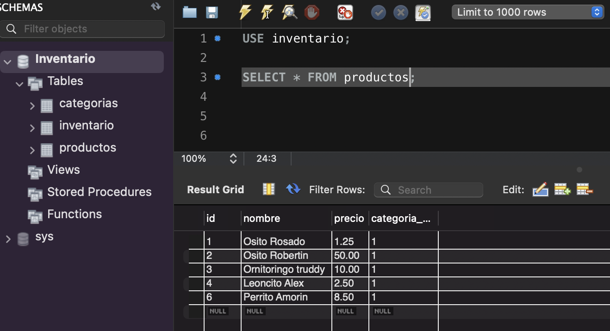
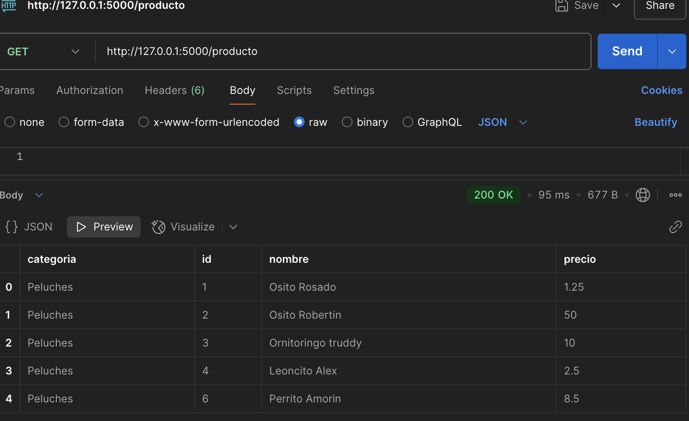

# PythonAPI
# API de Inventario con Flask y MySQL

Este proyecto es una API RESTful para la gestión de inventario de productos, desarrollada con Flask y MySQL.

## Requisitos

- Python 3.x
- Flask
- MySQL
- Postman (para pruebas opcionales)

## Instalación

1. Clona el repositorio o copia los archivos `main.py` y `db.py`.
2. Instala las dependencias necesarias:
   ```sh
   pip install flask mysql-connector-python
   ```
3. Configura la base de datos en `db.py`:
   ```python
   mydb = mysql.connector.connect(
       host="localhost",  
       user="root",  
       password="tu_contraseña",
       database="inventario"
   )
   ```

## Estructura de la Base de Datos

### Tablas
```sql
CREATE TABLE categorias (
    id INT AUTO_INCREMENT PRIMARY KEY,
    nombre VARCHAR(100) NOT NULL
);

CREATE TABLE productos (
    id INT AUTO_INCREMENT PRIMARY KEY,
    nombre VARCHAR(150) NOT NULL,
    precio DECIMAL(10,2) NOT NULL,
    categoria_id INT,
    FOREIGN KEY (categoria_id) REFERENCES categorias(id) ON DELETE SET NULL
);

CREATE TABLE inventario (
    id INT AUTO_INCREMENT PRIMARY KEY,
    producto_id INT NOT NULL,
    cantidad INT NOT NULL,
    fecha_actualizacion TIMESTAMP DEFAULT CURRENT_TIMESTAMP ON UPDATE CURRENT_TIMESTAMP,
    FOREIGN KEY (producto_id) REFERENCES productos(id) ON DELETE CASCADE
);
```

## Uso de la API

### Iniciar el Servidor
Ejecuta el siguiente comando en el directorio del proyecto:
```sh
python main.py
```

### Endpoints

#### Obtener todos los productos
**GET** `/producto`

#### Obtener un producto por ID
**GET** `/producto/<int:producto_id>`

#### Crear un nuevo producto
**POST** `/producto`
**Body (JSON):**
```json
{
    "nombre": "Osito Rosado",
    "precio": 1.50,
    "categoria": "Peluches"
}
```

#### Actualizar un producto
**PUT** `/producto/<int:producto_id>`
**Body (JSON):**
```json
{
    "nombre": "Osito Azul",
    "precio": 2.00,
    "categoria": "Peluches"
}
```

#### Eliminar un producto
**DELETE** `/producto/<int:producto_id>`

### Comprobación de la Base de Datos


### Comprobación en Postman


## Autor
Andrea Sierra

## Licencia
MIT

